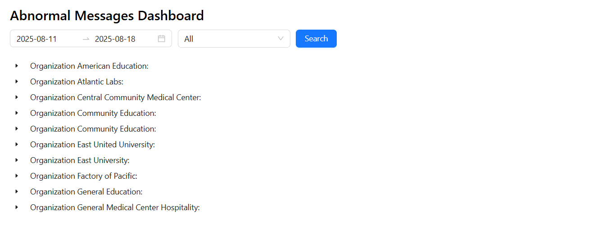
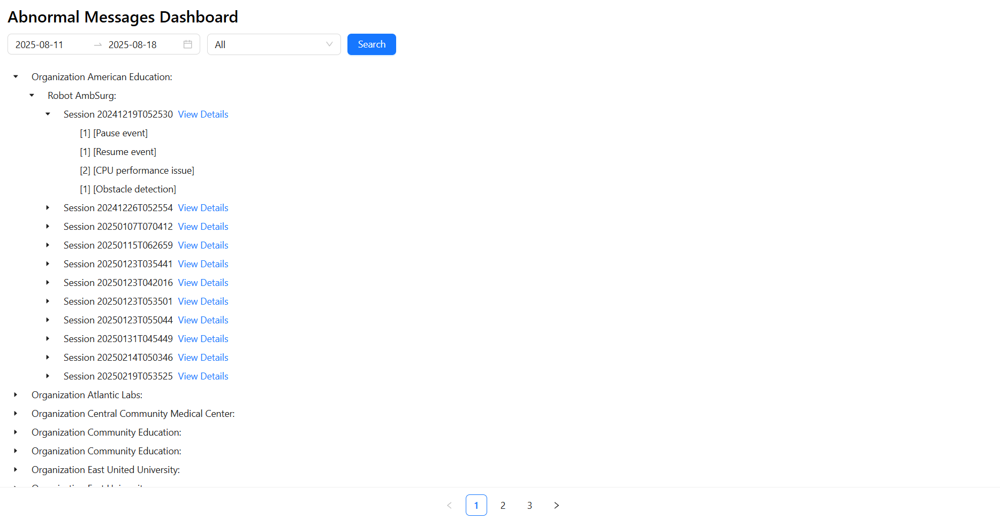
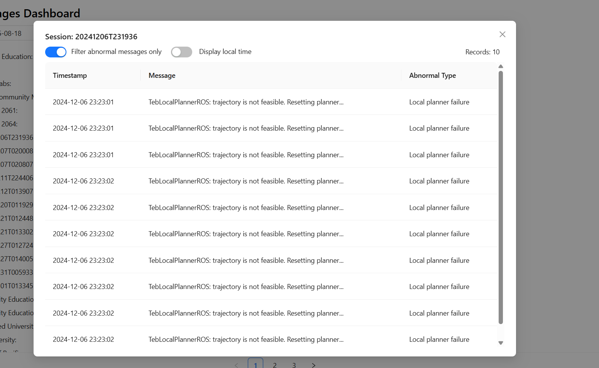

# **Robot Log Analysis System**

### **1\. Overview**

This is a comprehensive system for analyzing robot log files and identifying abnormal messages. The system is split into two main parts: a **backend** that handles data extraction and provides APIs, and a **frontend** that offers a user-friendly interface for viewing and interacting with the log data.

### **2\. Technologies Used**

- **Backend:** Node.js, Express.js
- **Frontend:** React.js
- **Database:** MongoDB
- **Language:** TypeScript

### **3\. Setup Instructions**

#### **Step 1: Clone the repository**

git clone \<repository-url\>  
cd robot-log-analysis

#### **Step 2: Install dependencies for both Backend and Frontend**

\# Install backend dependencies  
cd server  
npm install  
cd ../

\# Install frontend dependencies  
cd client  
npm install  
cd ../

#### **Step 3: Configure Environment Variables**

Create a .env file in the root directory of the **server** project (robot-log-analysis/server).

\# MongoDB Connection  
MONGO_URI=mongodb://localhost:27017/robot_logs

\# Database and Collection Names  
DB_NAME=robot_logs  
LOGS_COLLECTION=logs

Create a .env file in the root directory of the **client** project (robot-log-analysis/client) and update the API endpoint variable.

#### **Step 4: Run the Application**

First, run the data extraction script from the **server** directory to populate the database:

cd server  
npm run extract

Then, start both the backend and frontend servers:

\# From the root directory, start both servers concurrently  
\# (requires a tool like \`concurrently\` or two separate terminal windows)

\# Terminal 1: Start backend  
cd server  
npm run dev

\# Terminal 2: Start frontend  
cd client  
npm run start

The backend will run on http://localhost:4000 and the frontend will be available at http://localhost:3000.

### **4\. Detailed Features**

#### **Data Extraction (Backend)**

- Reads log data from log.csv.
- Stores data in MongoDB with an optimized document structure.

#### **Web Interface (Frontend)**

- **Filtering Panel:** Allows users to filter logs by date range and organization.
- **Hierarchical Results Display:** Presents data structured as Organization \-\> Robot \-\> Session.
- **Session Detail Modal:** A modal view showing detailed log entries for a specific session, with options to filter for abnormal messages and toggle between UTC and local time.

### **5\. Screenshots**

### Dashboard

### Result Display

### Session Details Modal

### **6\. Demo Video**

- [Demo Video](videos/demo.mp4)

### **7\. Contact & Support**

For issues, please contact via email or open an issue on GitHub.
